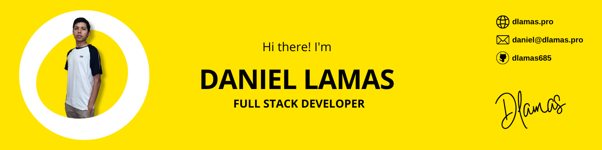

### Hi there! I'm Daniel Ignacio Lamas 
 **Full Stack Developer | Software Architecture | AI & Process Optimization Enthusiast**

I'm a full stack developer with a strong background in Computer Engineering — currently awaiting my final degree exam.
I’m passionate about artificial intelligence, intelligent process automation, and designing clean, scalable software architectures that deliver real-world value.
I combine frontend, backend, and distributed systems expertise to tackle complex challenges, always focused on best practices, accessibility, and performance.

### Tech Stack

#### UI Frameworks & Web Technologies

#### Backend Frameworks & Libraries

#### Databases & Messaging

#### ORMs & Data Modeling

#### State & Reactive Programming

#### Programming Languages

#### Tooling & Developer Experience

### Technical Interests & Experience

- Frontend development focused on semantic HTML, accessibility, and component-based UI/UX best practices.  
- Implementation of CSS architectures such as **7-1 Pattern**, **Atomic Design**, and naming methodologies like **BEM** and **SUITCSS**.  
- Building robust **Single Page Applications (SPAs)** and **Multi-Page Applications (MPAs)** with optimized routing and performance.  
- Mastery of rendering strategies including **SSR**, **CSR**, **ISR**, and **SSG** to enhance performance and **SEO**.  
- Creating **Progressive Web Apps (PWAs)** with installable features, offline support, and advanced optimization.  
- Backend development using both **monolithic** and **microservices** architectures, following clean code principles.  
- Automation of background jobs and scheduled tasks with tools like **BullMQ** and **Redis**.  
- **Integration of third-party services** through REST APIs, Web Services, and SDKs, including platforms like Google Maps Platform and OpenAI.  
- **WebRTC-based real-time communication**, enabling peer-to-peer audio/video channels and live interaction experiences.

  
### GitHub Stats

<!--
**dlamas685/dlamas685** is a ✨ _special_ ✨ repository because its `README.md` (this file) appears on your GitHub profile.

Here are some ideas to get you started:

- 🔭 I’m currently working on ...
- 🌱 I’m currently learning ...
- 👯 I’m looking to collaborate on ...
- 🤔 I’m looking for help with ...
- 💬 Ask me about ...
- 📫 How to reach me: ...
- 😄 Pronouns: ...
- ⚡ Fun fact: ...
-->
